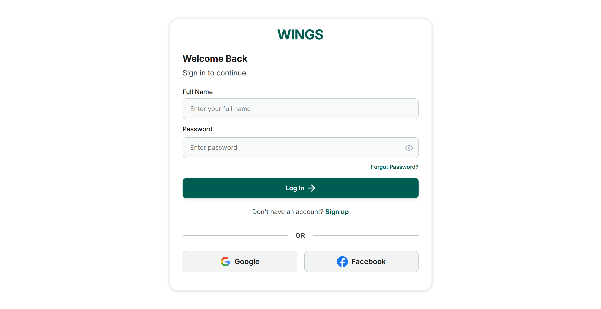
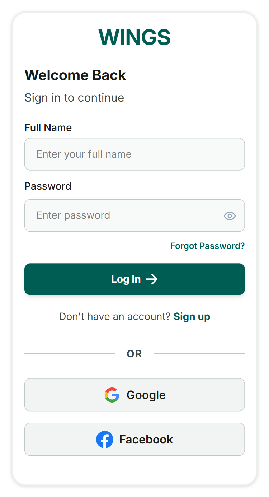

# WINGS Frontend

This is the frontend application for the WINGS platform. It provides a modern React-based user interface for authentication, role-based dashboards, and reusable UI components.

## Overview

The app is built with React and Vite, with routing for different user experiences and Tailwind CSS for styling. The frontend includes flows for authentication, employer-facing views, and worker-facing views.

## Tech Stack

- React 19
- Vite 8
- React Router DOM
- Tailwind CSS
- Lucide React for icons
- React Context for authentication state
- ESLint for code quality

## Getting Started

### Prerequisites

Make sure you have the following installed:

- Node.js 18 or newer
- npm 9 or newer

### Install Dependencies

```bash
npm install
```

### Start the Development Server

```bash
npm run dev
```

Once the server starts, open the local URL shown in the terminal (usually http://localhost:5173).

## Available Scripts

- `npm run dev` — start the local development server
- `npm run build` — create a production build
- `npm run preview` — preview the production build locally
- `npm run lint` — run ESLint checks

## Production Build

To build the app for production:

```bash
npm run build
```

To preview the production build locally:

```bash
npm run preview
```
## Got docker ? :p

Build the image⤵︎

```bash
docker build -t wings-frontend .
```

Run the container⤵︎

```bash
docker run -p 3000:80 wings-frontend
```

Open: http://localhost:3000

## Stop container

Press Ctrl + C then⤵︎

```bash
docker ps 
docker stop <container-id>
```

## UI Screenshots / GIFs

<div align="center">
  <h3>Desktop & Mobile Views</h3>
  
  
  
  <br><br>
  
  <h3>Authentication UI Demo</h3>
  <video src="./src/assets/screenshots/authentication-demo.mp4" width="96%" controls></video>

</div>

